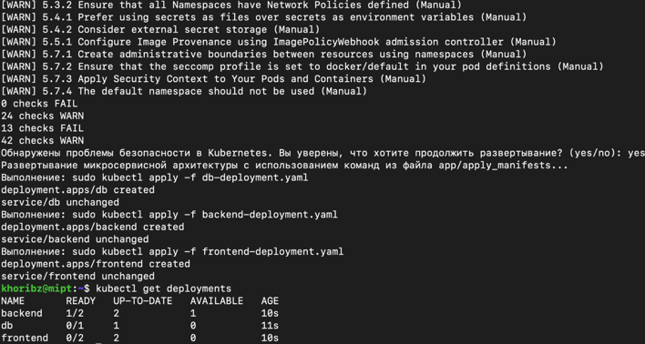

## Реализация скриптов для автоматической проверки на уязвимости и развертывания микросервисных архитектур при помощи Docker контейнеров и Kubernetes
### 1) Проверка установленной Docker системы на уязвимости по CIS Docker Benchmark v1.6.0 при помощи docker-bench-security
Перед запуском желаемого контейнера рекомендуется запустить следующие команды:
```
git clone https://github.com/khoribz/CIS-benchmarks-wrappers.git
cd CIS-benchmarks-wrappers
chmod +x test_docker.sh
```
Запуск скрипта предложит ввести имя контейнера, образ, из которого он будет собран, а также дополнительные опции (например, проброс портов). Затем будут выведены обнаруженные проблемы, которые можно решить, используя команды из **CIS Docker Benchmark v1.6.0**. Если проблемы не являются значимыми для безопасности, можно продолжить запуск контейнера.


### 2) Проверка безопасности Kubernetes с использованием CIS Kubernetes Benchmark
Для проверки безопасности при запуске приложения в **Kubernetes** рекомендуется использовать **CIS Kubernetes Benchmark**. Утилита ***kube-bench*** позволяет выполнить такую проверку. Пусть ваше приложение состоит из нескольких сервисов, манифесты которых описаны в директории app, а команды для применения манифестов — в файле app/apply_manifests.
Следует установить ***kube-bench*** на свою систему согласно документации. После этого для предварительной проверки применения манифестов и поиска уязвимостей выполните:
```
git clone https://github.com/khoribz/CIS-benchmarks-wrappers.git
cd CIS-benchmarks-wrappers
chmod +x test_kubernetes.sh
```
Обнаруженные уязвимости будут отображены на экране, и потребуется дополнительное согласие на применение манифестов.
Каждая проверка выводит результат с указанием статуса (WARN или FAIL), что позволяет пользователю быстро идентифицировать и устранять проблемы безопасности.



### Важные замечания
Стоит отметить, что ***docker-bench-security*** проверяет только конфигурацию **Docker** и не анализирует уязвимости внутри контейнеров. Для комплексного анализа безопасности необходимо использовать дополнительные инструменты. Аналогично и ***kube-bench*** фокусируется исключительно на проверке конфигураций **Kubernetes** на соответствие **CIS Benchmark**. Он не выполняет динамический анализ, тестирование проникновения или мониторинг времени выполнения, что требует использования дополнительных инструментов для комплексного обеспечения безопасности.

### Скрипт test_trivy_docker.sh

Скрипт **test_trivy_docker.sh** предназначен для автоматического сканирования **Docker**-образов на наличие уязвимостей с использованием инструмента ***Trivy***. Он принимает имя **Docker**-образа в качестве аргумента, выполняет сканирование и анализирует результаты. Если обнаруживаются критические или высокие уязвимости, скрипт предупреждает пользователя и запрашивает подтверждение на продолжение развертывания.
Запуск 
```./test_trivy_docker.sh <имя_образа>```
Среди описания всех имеющихся зависимостей выведутся наиболее опасные.


### Скрипт test_trivy_kubernetes.sh 
Скрипт **test_trivy_kubernetes.sh** предназначен для автоматизации процесса проверки безопасности **Kubernetes**-кластера с помощью ***kube-bench*** и последующего развертывания микросервисной архитектуры, если проверка безопасности проходит успешно. 
Запуск ```./kubernetes_deployment.sh```
Если обнаружены проблемы безопасности, пользователю предлагается решить, продолжать ли развертывание. При успешном прохождении проверок осуществляется развертывание микросервисной архитектуры с помощью команд ***kubectl*** из файла app/apply_manifests. Для каждой уязвимости будет предоставлена ссылка на способы митигации.


### Заключение
Использование этих инструментов и скриптов позволяет автоматизировать процесс проверки на уязвимости и развертывания микросервисных архитектур, обеспечивая высокий уровень безопасности и соответствие лучшим практикам.